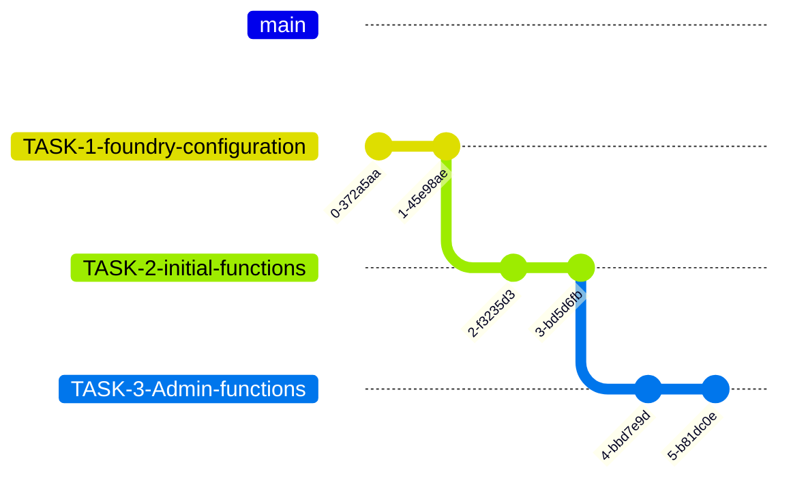

# Blockchain Technical Assessment Instructions

1. Unzip the original repository.

2. Create a new private repository on your GitHub account.

3. Add the following GitHub users as collaborators to your new repository: `xaler5`, `nabil-brickken`.

4. Clone your new repository to your local development environment.

5. Copy the content from the original repository to your new repository.

6. Make the initial commit.

7. Bellow in this document you will find the tasks to be completed within this challenge. The tasks should be performed in order. For each task, create a new branch with the same name of the task.  For example, for the first task named `Install and configure Foundry` you should create a branch named `TASK-1-foundry-configuration`.

8. Once you complete a task, create a pull request with the main branch as the base.

9. For the next task, create a new branch from the branch of the previous task (not from the main branch). When
   finished, create a pull request with the branch of the previous task as the base.

10. Repeat step 9 for all remaining tasks.

### Branching Strategy

Remember that each pull request should be reviewed and approved before being merged with the base branch. Keep your
commits small and frequent to facilitate code review.

### Tasks

 1. Install and configure Foundry 

&emsp; Requirements:

- This project requires [Foundry development toolkit](https://github.com/foundry-rs/foundry). 

- Install and configure foundry dependencies as needed (i.e. <i>Foundry.toml and remmappings</i>)
- Checkout foundry installation guide [Installation Guide](https://getfoundry.sh/introduction/installation/). 

 2. Implement Perpetual Staking initial functions

- Add events.
- Implement modifiers.
- Implement [INITIALIZATION Section](./contracts/staking/PerpetualStaking.sol#L120)

 3. Implement Perpetual Staking Admin functions

- Implement [PAUSE/UNPAUSE Section](./contracts/staking/PerpetualStaking.sol#L157)
- Implement [TOKEN MANAGEMENT Section](./contracts/staking/PerpetualStaking.sol#L191)

 4. Implement Perpetual Staking yield management and userfunctions

- Implement [PRIVATE Functions Section](./contracts/staking/PerpetualStaking.sol#L378)
- Implement [YIELD SCHEDULE MANAGEMENT Section](./contracts/staking/PerpetualStaking.sol#L214)
- Implement [DEPOSIT Section](./contracts/staking/PerpetualStaking.sol#L263)
- Implement [COMPOUND Section](./contracts/staking/PerpetualStaking.sol#L283)
- Implement [CLAIM Section](./contracts/staking/PerpetualStaking.sol#L313)

 5. Implement Perpetual Staking view functions

- Implement [VIEW FUNCTIONS Section](./contracts/staking/PerpetualStaking.sol#L337)

 6. Implement Perpetual Staking unit tests with foundry

&emsp;   Implement unit tests to ensure at least <b>80% coverage, adding more tests if needed. </b>

Modify the Perpetual Staking contract as you need. 

- Implement [SETUP Section](./test/staking/PerpetualStaking.t.sol#L30)
- Implement [INITIALIZATION Section](./test/staking/PerpetualStaking.t.sol#L46)
- Implement [DEPOSIT Section](./test/staking/PerpetualStaking.t.sol#L60)
- Implement [CLAIM Section](./test/staking/PerpetualStaking.t.sol#L97)
- Implement [COMPOUND Section](./test/staking/PerpetualStaking.t.sol#L147)
- Implement [YIELD SCHEDULE Section](./test/staking/PerpetualStaking.t.sol#L178)
- Implement [VIEW FUNCTIONS Section](./test/staking/PerpetualStaking.t.sol#L223)
- Implement [ADMIN FUNCTIONS Section](./test/staking/PerpetualStaking.t.sol#L265)

